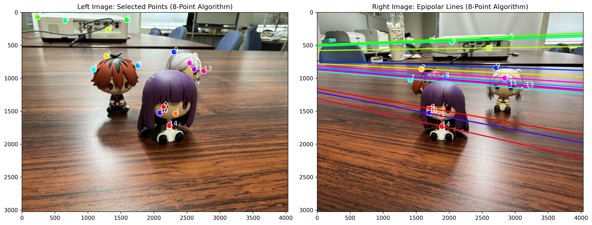
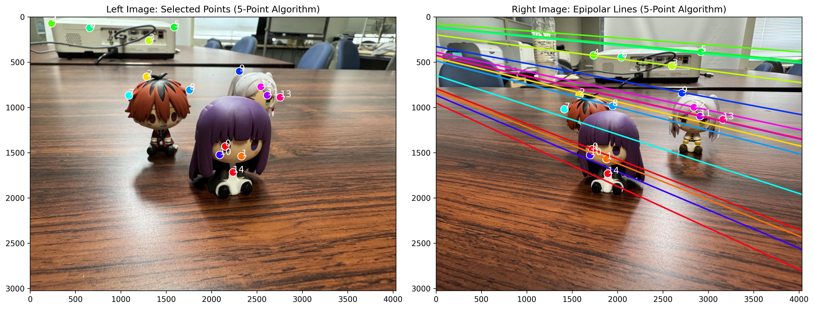
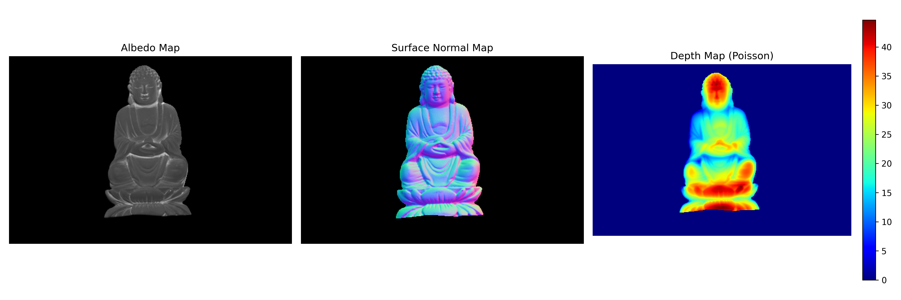
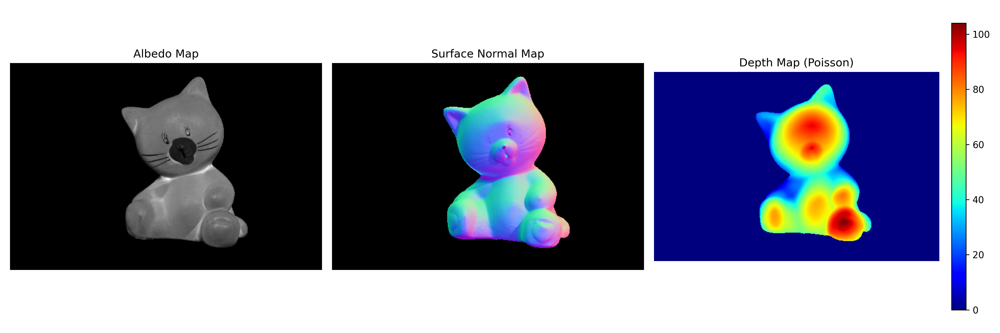
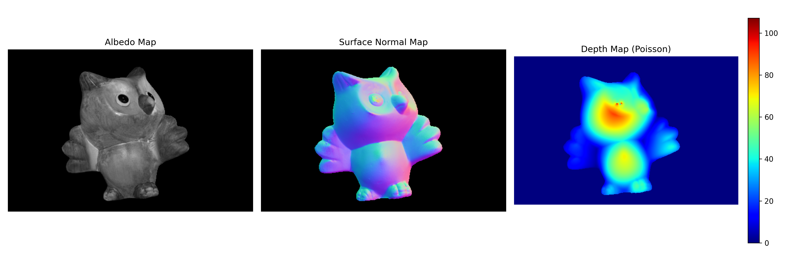

# Computer Vision Report No. 2
**Topic:** 5-Point Algorithm and Photometric Stereo
**Date:** May 31, 2026
**Name:** 石 行
**Student ID:** 2IE26035R

---

## 1. Part A: Fundamental Matrix Estimation & 5-Point Algorithm

### A-1. Survey of the 5-Point Algorithm vs. 8-Point Algorithm
The estimation of epipolar geometry relies on finding correspondences between two stereo images. While the **8-point algorithm** is simple, linear, and computationally fast, it requires a minimum of 8 point correspondences to solve for the Fundamental matrix $F$. It ignores the internal constraints of the Essential matrix $E$ (namely, that the two non-zero singular values of $E$ must be equal) and can fail if the points lie on a degenerate configuration, such as a planar surface.

In contrast, the **5-point algorithm** (proposed by Nistér) operates on calibrated cameras, requiring only 5 point correspondences to compute the Essential matrix $E$. It explicitly enforces the non-linear algebraic constraints of the Essential matrix ($2 E E^T E - \text{trace}(E E^T) E = 0$). Because it requires fewer points, it is highly efficient inside a RANSAC loop for robust outlier rejection. Furthermore, the 5-point algorithm remains stable even when the observed scene points are coplanar, a scenario where the 8-point algorithm fundamentally fails. However, solving the 5-point algorithm involves finding the roots of a 10th-degree polynomial, making it mathematically more complex and computationally slightly heavier per iteration than the 8-point method.

### A-2. Comparison between 5-Point and 8-Point Algorithms
We ran both algorithms on the `Scene1` dataset with 15 matched point pairs. 

**Performance Observations:**
- **8-Point Algorithm:** Computed the Fundamental matrix in roughly `0.0037` seconds.
- **5-Point Algorithm:** Computed the Essential matrix (and converted to $F$) in roughly `0.0516` seconds using RANSAC.
- While the 5-point algorithm took slightly longer in total execution time due to RANSAC iterations and complex polynomial roots, it achieved robust filtering of inliers. Out of the 15 points, 7 were strictly classified as inliers under the 1-pixel threshold.

**Numerical Matrix Comparison:**
The Fundamental matrix $F_{8pt}$ computed by the 8-point algorithm (normalized to $f_{33} = 1$) is:

$$
F_{8pt} = \begin{bmatrix}
0.000000 & 0.000001 & -0.001151 \\
-0.000001 & 0.000000 & 0.000059 \\
0.000958 & -0.001297 & 1.000000
\end{bmatrix}
$$

For comparison, the Fundamental matrix $F_{5pt}$ (derived from $E$ assuming $K=I$) computed by the 5-point algorithm is:

$$
F_{5pt} = \begin{bmatrix}
0.271531 & 1.872388 & 194.653573 \\
-2.933477 & 1.303645 & -4428.664980 \\
326.684443 & 4420.887490 & 1.000000
\end{bmatrix}
$$

**Visual Results (Epipolar Lines):**
The following images show the epipolar lines drawn on the right image for the points selected on the left image. Both algorithms successfully map the epipolar lines to intersect the corresponding points.

*Figure 1: Epipolar lines computed using the 8-Point Algorithm.*

*Figure 2: Epipolar lines computed using the 5-Point Algorithm.*

---

## 2. Part B: Photometric Stereo (Task B-2)

### B-2-1. Methodology
The photometric stereo method was used to reconstruct the surface normal and albedo of various objects (`buddha`, `cat`, `owl`) from the provided dataset. We assume a Lambertian reflectance model, where the image intensity $I$ is given by the dot product of the light direction vector $L$ and the surface normal $N$, scaled by the albedo $\rho$:
$I = \rho (L \cdot N)$

By stacking the light vectors into a matrix $L$ and the intensities for a single pixel across images into a vector $I$, we can solve for the scaled normal vector $G = \rho N$ using the linear least-squares method:
$G = (L^T L)^{-1} L^T I$

The albedo is the magnitude of $G$, and the normalized surface normal is $N = G / \|G\|$.

### B-2-2. Results and Visualizations
The recovered normals $(n_x, n_y, n_z)$ are mapped to $(R, G, B)$ color channels using the transformation: 
`Color = (N + 1.0) / 2.0 * 255`

In addition, we performed the optional **Poisson surface reconstruction** (using the Frankot-Chellappa algorithm in the frequency domain) to recover the 3D depth map from the surface normals.

Below are the albedo, normal, and depth maps computed for the objects:

#### 1. Buddha

*Figure 3: Albedo Map, Surface Normal Map, and Poisson Depth Map for the Buddha dataset.*

#### 2. Cat

*Figure 4: Albedo Map, Surface Normal Map, and Poisson Depth Map for the Cat dataset.*

#### 3. Owl

*Figure 5: Albedo Map, Surface Normal Map, and Poisson Depth Map for the Owl dataset.*

### B-2-3. Discussion
The least-squares approach accurately separated the illumination into albedo (the underlying texture and reflectivity of the object) and surface normal vectors. The normal maps successfully capture the 3D curvature of the objects, demonstrated by the smooth color gradients (e.g., green representing normals pointing upwards, red/pink pointing rightwards, and blue pointing towards the camera). 

Furthermore, integrating these normals via the **Poisson equation** successfully recovered the continuous 3D depth of the objects. The shadows and specular highlights, which slightly violate the purely Lambertian assumption, did not significantly deteriorate the normal estimation or the depth integration due to the robustness of the overdetermined system (12 light sources).
